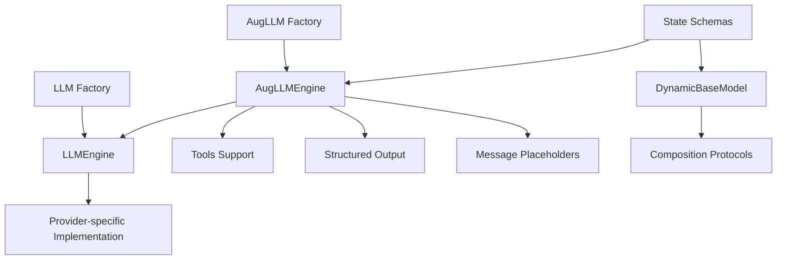

# LLM Module Structure Overview

## Directory Structure

```
src/ooai/core/
├── llm/                    # Core LLM infrastructure
│   ├── engine.py          # LLMEngine: Base LLM engine class
│   └── factory.py         # LLM factory function for creating engines
│
├── llms/                   # Legacy/alternative LLM implementations
│   └── base/              # Base LLM components
│       ├── engine.py      # Base engine implementation
│       ├── enums.py       # Enumerations for LLM types
│       └── providers/     # Provider-specific implementations
│
└── engine/
    └── llm/               # Advanced LLM engines
        └── aug_llm_engine.py  # AugLLM: Augmented LLM with tools & structured output
```

## Module Purposes

### 1. `/core/llm/` - Core LLM Infrastructure
**Purpose**: Main LLM interface and factory pattern
- **`engine.py`**: `LLMEngine` class - Core engine for language models
- **`factory.py`**: `LLM()` factory function - Creates LLM engines with provider auto-detection
- **Usage**: Primary interface for creating and using LLMs

```python
from ooai.core.llm import LLM, LLMEngine

# Create an LLM using factory
llm = LLM(model="gpt-4")  # Auto-detects OpenAI provider
llm = LLM(model="claude-3")  # Auto-detects Anthropic provider
```

### 2. `/core/llms/` - Legacy/Base Components
**Purpose**: Lower-level base components and provider-specific implementations
- Appears to be an older or alternative implementation path
- Contains base classes and provider enumerations
- May be used internally by the main LLM module

### 3. `/core/engine/llm/` - Advanced LLM Engines
**Purpose**: Specialized LLM engines with advanced features
- **`aug_llm_engine.py`**: `AugLLM` and `AugLLMEngine`
  - Augmented LLM with tool calling
  - Structured output support
  - Complex prompt management
  - Message placeholder integration
  - State schema compatibility

```python
from ooai.core.engine.llm import AugLLM

# Create augmented LLM with advanced features
aug_llm = AugLLM(
    model="gpt-4",
    prompt="Complex prompt with {placeholders}",
    tools=[tool1, tool2],
    add_messages_placeholder=True,
    structured_output=OutputSchema
)
```

## Test Structure

```
tests/engine/
├── llm/
│   ├── test_aug_llm_simple.py              # Basic AugLLM tests
│   ├── test_aug_llm_engine.py              # Core AugLLM engine tests
│   ├── test_aug_llm_comprehensive.py       # Comprehensive feature tests
│   ├── test_aug_llm_comprehensive_suite.py # Full test suite
│   ├── test_aug_llm_e2e.py                # End-to-end tests
│   ├── test_state_schema_experiments.py    # State schema integration (experimental)
│   └── test_state_schema_fixed.py          # State schema with fixes (working)
│
├── test_llm_cache.py                        # LLM caching tests
└── test_llm_usage.py                        # LLM usage tracking tests
```

## Current Status

### ✅ Working Components

1. **Core LLM Module (`/core/llm/`)**
   - `LLMEngine`: Base engine class
   - `LLM()` factory: Creates engines with provider auto-detection
   - Provider support: OpenAI, Anthropic, Google, etc.

2. **AugLLM Engine (`/core/engine/llm/`)**
   - Full-featured augmented LLM engine
   - Tool calling support
   - Structured output
   - Complex prompt templates
   - Message placeholder support
   - State schema integration (with fixes applied)

3. **State Schema Integration**
   - Fixed default value preservation in composition
   - Working with AugLLM for stateful conversations
   - Test coverage in `test_state_schema_fixed.py`

### 🔧 Recent Fixes

1. **Default Value Preservation** (Applied)
   - Fixed in `/core/models/dynamic_base_model/protocols/relationships.py`
   - Fixed in `/core/models/dynamic_base_model/protocols/batch.py`
   - Properly handles `Field` defaults and `default_factory`

2. **State Schema Composition**
   - Created working composition function in `test_state_schema_fixed.py`
   - Full integration with AugLLM engine
   - Example in `examples/state_schema_aug_llm.py`

## Test Coverage Status

### Likely Passing Tests
- `test_state_schema_fixed.py` - ✅ All 8 tests passing (verified)
- Basic LLM factory tests
- Provider detection tests

### Potentially Failing/Needs Investigation
- `test_state_schema_experiments.py` - Has unfixed default value issues
- Some comprehensive AugLLM tests may timeout without proper LLM config
- E2E tests require actual LLM API keys

## Key Relationships



## Usage Recommendations

1. **For Simple LLM Usage**: Use `LLM()` from `/core/llm/`
2. **For Advanced Features**: Use `AugLLM()` from `/core/engine/llm/`
3. **For Stateful Conversations**: Combine state schemas with AugLLM
4. **For Testing**: Mock LLM responses to avoid API calls

## Example: Complete Integration

```python
from ooai.core.engine.llm import AugLLM
from ooai.core.models import DynamicBaseModel
from pydantic import Field
from typing import List

# Define state schema
class ConversationState(DynamicBaseModel):
    session_id: str
    topics: List[str] = Field(default_factory=list)
    turn_count: int = Field(default=0)

# Create AugLLM with state awareness
engine = AugLLM(
    model="gpt-4",
    prompt="""Session {session_id}, Turn {turn_count}
    Topics: {topics}

    {messages}

    User: {input}""",
    add_messages_placeholder=True,
    messages_placeholder_name="messages"
)

# Use with state
state = ConversationState(session_id="test-001")
state.turn_count += 1
response = engine.invoke(state.model_dump() | {"input": "Hello!"})
```

## Next Steps

1. **Consolidation**: Consider merging `/core/llms/` with `/core/llm/` if legacy
2. **Documentation**: Add docstrings to all public APIs
3. **Test Coverage**: Ensure all paths have test coverage
4. **Examples**: Create more examples showing different use cases
5. **Performance**: Add benchmarks for different providers